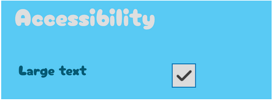
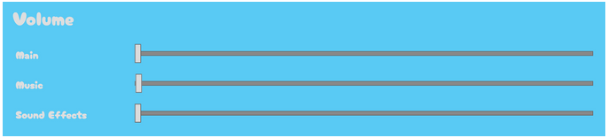
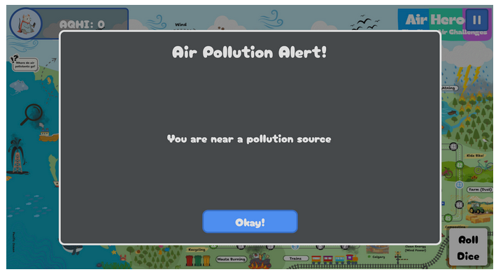
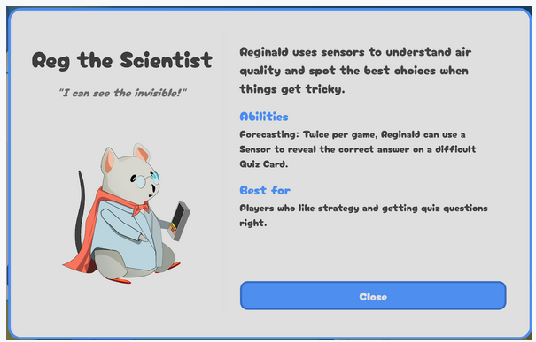
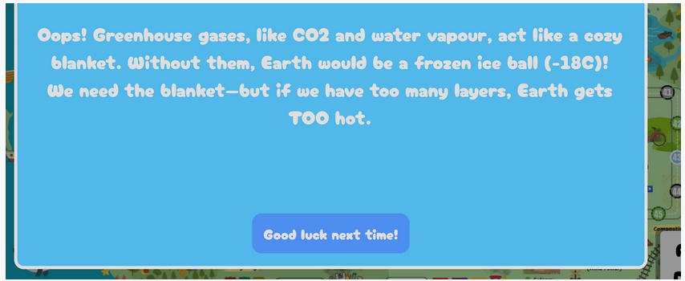
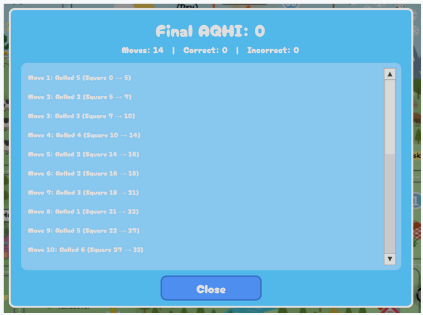
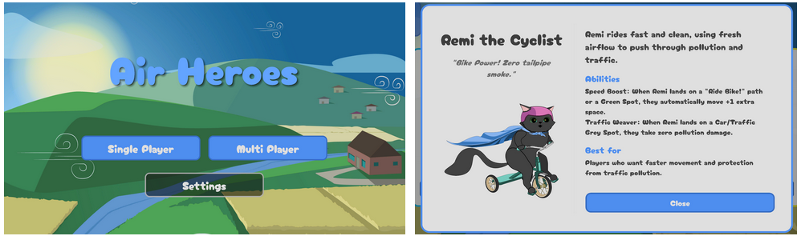
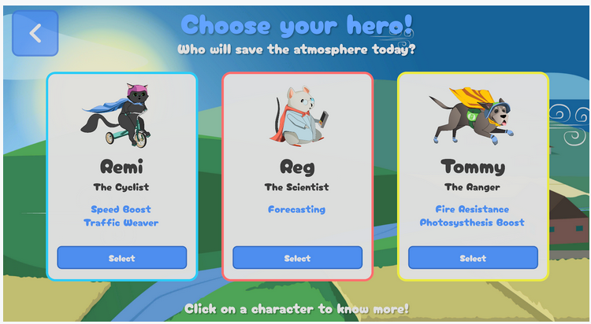
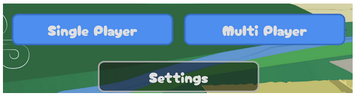
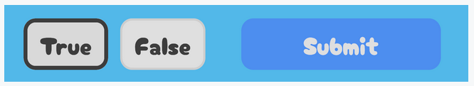

| Category      | Principle / Heuristic                                   | Status  | Details                                                                                                                                                                                                                                                                                                                                                                                                                                                            | Where                                                                                                                         |
| ------------- | ------------------------------------------------------- | ------- | ------------------------------------------------------------------------------------------------------------------------------------------------------------------------------------------------------------------------------------------------------------------------------------------------------------------------------------------------------------------------------------------------------------------------------------------------------------------ | ----------------------------------------------------------------------------------------------------------------------------- |
| CRAP          | Contrast                                                | Applied | Buttons and clickable elements use visible state changes on hover so players can immediately tell what is interactive. [ ](https://www.dropbox.com/scl/fi/cy4ghz5pz9yzxp0k5z4nx/Recording-2026-03-07-181037.gif?rlkey=sb9lv1rbwaqseb6k2s9eq0csg&e=2&st=ahx1tzjn&dl=0)[View GIF](https://www.dropbox.com/scl/fi/cy4ghz5pz9yzxp0k5z4nx/Recording-2026-03-07-181037.gif?rlkey=sb9lv1rbwaqseb6k2s9eq0csg&e=2&st=ahx1tzjn&dl=0)                                   | Main menu buttons, character selection buttons, settings buttons, blue card answer buttons, final score close button          |
| CRAP          | Contrast                                                | Applied | Buttons use visible state changes on press so players can immediately tell when an action has been selected.  [View GIF](https://www.dropbox.com/scl/fi/q1rmokqhzmuxzegaz3mye/Recording-2026-03-08-191925.gif?rlkey=o06afn7lrvxj5hbidtdty9qjb&st=w1g0ctxh&dl=0)                                                                                                                                                                                              | Main menu buttons, character selection buttons, blue card answer buttons, settings buttons                                    |
| Nielsen       | Error Prevention                                        | Applied | Button press state prevents accidental repeated activation (does not trigger action multiple times).                                                                                                                                                                                                                                                                                                                                                               | Selection buttons and action buttons across menus and question screens                                                        |
| Nielsen       | Error Prevention                                        | Applied | Guard implemented to ensure the Scientist’s Sensor ability cannot be used more than once per question, so the player does not accidentally waste both of its limited uses on the same question.                                                                                                                                                                                                                                                                    | Scientist ability on blue trivia/question cards                                                                               |
| Accessibility | Accessibility                                           | Applied | Font size accessibility toggle exists in Settings menu. When enabled, the game applies a larger-font stylesheet across the UI so facts, questions, buttons, and feedback text are easier to read. Font size setting is saved and persists between sessions.                                                                                                                                                                                                         | Settings menu → Accessibility section; applied across menus, cards, buttons, and feedback screens                             |
| Accessibility | Accessibility                                           | Planned | Text-to-Speech accessibility setting with speaker toggle on fact/question cards and stop/restart behaviour.                                                                                                                                                                                                                                                                                                                                                        | Planned for blue fact cards and blue trivia/question cards                                                                    |
| Accessibility | Accessibility                                           | Applied | Adjustable audio in the Settings, allowing players to reduce or mute music and sound effects based on comfort and sensory preferences. Audio settings are saved and persists between sessions.                                                                                                                                                                                                                                                                     | Settings menu → Volume section                                                                                                |
| CRAP          | Contrast                                                | Applied | Selected MCQ answers look different from unselected ones.                                                                                                                                                                                                                                                                                                                                                                                                       | Blue trivia/question cards                                                                                                    |
| CRAP          | Repetition                                              | Applied | Consistent modal structure across game: dim backdrop + centered popup card.                                                                                                                                                                                                                                                                                                                                                                                     | Grey alert pop-up, settings pop-up, blue card pop-ups, character info pop-up, final score pop-up                              |
| Nielsen       | Help and Documentation                                  | Applied | Character selection includes “Click on a character to know more!” The player can see a character info popup that provides help through descriptions, abilities, and best-for guidance.                                                                                                                                                                                                                                                                             | Character selection screen and character info pop-up                                                                          |
| Nielsen       | Help Users Recognize, Diagnose, and Recover from Errors | Applied | Wrong answers explicitly say they are incorrect.                                                                                                                                                                                                                                                                                                                                                                                                                | Blue trivia/question feedback screen                                                                                          |
| Nielsen       | Help Users Recognize, Diagnose, and Recover from Errors | Applied | Feedback includes an explanation message, not just correct/incorrect. Additionally, wrong-answer feedback appears before the backstep consequence, so the player sees what happened first.                                                                                                                                                                                                                                                                         | Blue trivia/question explanation and wrong-answer feedback screen                                                             |
| Accessibility | Accessibility                                           | Planned | Adjust difficulty dynamically would change question difficulty based on recent performance to reduce frustration and better support different learning speeds.                                                                                                                                                                                                                                                                                                     | Planned question system for blue trivia cards and difficulty progression during gameplay                                      |
| Nielsen       | Aesthetic and Minimalist Design                         | Applied | Main Menu, Settings, and Final Score pop-up are focused and present key actions. Final Score screen, for example, is to the point with top summary, history, and close.                                                                                                                                                                                                                                                                                            | Main menu, settings pop-up, final score pop-up                                                                                |
| CRAP          | Alignment                                               | Applied | Main menu: centered and grouped cleanly Settings: vertically aligned into title, volume section, accessibility section, close action Final Score: aligns summary at top, scrollable history in middle, close action at bottom Character Selection: left/right split layout, with image/title on the left and readable text on the right Character Info screens: consistent horizontal card row, with aligned titles, abilities, and select buttons  | Main menu, settings pop-up, final score pop-up, character selection screen, character info pop-up                             |
| CRAP          | Proximity                                               | Applied | Each character’s image, name, subtitle, abilities, and select button are grouped together, so each card reads as one choice.                                                                                                                                                                                                                                                                                                                                    | Character selection screen and character info pop-up                                                                          |
| Nielsen       | Visibility of System Status                             | Applied | Dice button shows the rolled value during movement, then returns to “Roll Dice.”  [View GIF](https://www.dropbox.com/scl/fi/nnh9orkec4g944ubuok90/Recording-2026-03-08-193211.gif?rlkey=elon4debm5tepg5air3gs5txc&st=4dh2w9y6&dl=0)                                                                                                                                                                                                                          | In-game board screen → Roll Dice button                                                                                       |
| Nielsen       | Visibility of System Status                             | Applied | AQHI score is always visible through label + progress bar.  [View GIF](https://www.dropbox.com/scl/fi/8ruur8ajva33awlh2h8dc/Recording-2026-03-08-193815.gif?rlkey=x2jghjc3w1o5b6r7ziqq6rlgu&st=pc52qu1m&dl=0)                                                                                                                                                                                                                                                | In-game board HUD / top-left AQHI display                                                                                     |
| Nielsen       | Consistency and Standards                               | Applied | Consistent font across scenes.                                                                                                                                                                                                                                                                                                                                                                                                                                  | Across all screens -- Main menu, character selection, character info pop-up, settings pop-up, in-game HUD, final score pop-up |
| Nielsen       | Consistency and Standards                               | Applied | Consistent hover/click treatment across interactive buttons.                                                                                                                                                                                                                                                                                                                                                                                                       | Interactive buttons across menus, pop-ups, and blue trivia/question cards                                                     |
| Nielsen       | User Control and Freedom                                | Applied | Back button on character selection, difficulty popup, and close buttons on settings, character info, and final score popups.                                                                                                                                                                                                                                                                                                                                       | Character selection screen, difficulty pop-up, settings pop-up, character info pop-up, final score pop-up                     |
| Nielsen       | User Control and Freedom                                | Applied | On MCQ cards, selection can be changed before submitting.                                                                                                                                                                                                                                                                                                                                                                                                 | Blue trivia/question cards                                                                                                    |