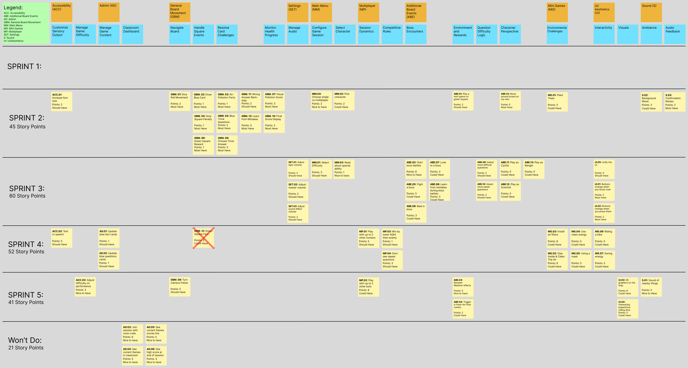

# Project Management

## Story Map

## Project Plan

### Sprint 1 (Feb 1)

| Task          | Assigned to   | Due Date  |
| ------------- | ------------- | --------- |
| Team Canvas                   | Everyone  | Jan 28    |
| Belbin Roles                  | Everyone  | Jan 28    |
| Project Glossary              | Vikasini  | Jan 28    |
| Sequence Diagram              | Ben       | Jan 28    |
| Technical Resources           | Ben       | Jan 28    |
| Detailed List of Technologies | Ben       | Jan 28    |
| User Stories                  | Maansi    | Jan 29    |
| US Acceptance Tests           | Sridhar   | Jan 29    |
| UML Class Diagrams            | Ipsa      | Jan 29    |
| Create & Fill MkDocs          | Sridhar   | Jan 28    |
| Story Map                     | Everyone  | Jan 30    |
| High-Level Software Design    | Eric      | Jan 30    |
| Update Documentation          | Sridhar   | Jan 30    |
| Low-Fidelity User Interface   | Pouyan    | Jan 31    |
| Make issues in Github Board   | Vikasini  | Jan 31    |
| Finish Acceptance Tests       | Ipsa      | Jan 31    |
| Similar Products              | Maansi    | Feb 1     |
| Open Source Projects          | Eric      | Feb 1     |
| Project Overview              | Vikasini  | Feb 1     |
| Final Checks & GitHub Release | Sridhar   | Feb 1     |

### Sprint 2 (Feb 15)
Estimated Sprint Velocity - 45

| Task          | Assigned to   | Due Date  |
| ------------- | ------------- | --------- |
| Unity Setup                   | Ben           | Feb 2     |
| Convert USs to tasks          | Everyone      | Feb 4     |
| Assign squares colors with callbacks | Ben    | Feb 5     |
| Move player characters        | Ben           | Feb 5     |
| Create blue cards             | Ben           | Feb 5     |
| Dice Rolling                  | Ben           | Feb 7     |
| Draw blue cards               | Ben           | Feb 8     |
| Show blue question cards      | Ben           | Feb 9     |
| Show blue fact cards          | Ben           | Feb 9     |
| GBM.01 Acceptance Tests       | Ben           | Feb 10    |
| GBM.02 Acceptance Tests       | Ben           | Feb 11    |
| GBM.04 Acceptance Tests       | Ben           | Feb 12    |
| GBM.03 Acceptance Tests       | Ben           | Feb 14    |
| Fix Board Layout              | Sridhar       | Feb 9     |
| Create Score Container        | Sridhar       | Feb 10    |
| Make Player AQHI Logic        | Sridhar       | Feb 10    |
| Progress Bar Logic            | Sridhar       | Feb 10    |
| Create Gray Cards + Logic     | Sridhar       | Feb 10    |
| Create Green Cards            | Sridhar       | Feb 10    |
| Match Green Cards to Squares  | Sridhar       | Feb 10    |
| Basic Score Balance           | Sridhar       | Feb 10    |
| Minigame Containers           | Sridhar       | Feb 10    |
| Sound Effects Logic           | Sridhar       | Feb 10    |
| UI Refining                   | Sridhar       | Feb 10    |
| Acceptance Tests              | Sridhar       | Feb 13    |
| Tests Categorization          | Sridhar       | Feb 15    |
| Implement Single vs Multiplayer flow | Maansi | Feb 10    |
| Main Menu mode selection (SP / MP) | Maansi   | Feb 10    |
| Character Selection Screen    | Maansi        | Feb 10    |
| Display abilities on card     | Maansi        | Feb 10    |
| Character info popup          | Maansi        | Feb 10    |
| Multiplayer character pick flow | Maansi      | Feb 11    |
| Prevent game start without character | Maansi | Feb 11    |
| Scene Transition              | Maansi        | Feb 11    |
| Background music playback     | Maansi        | Feb 14    |
| MM.02 Pick Character tests    | Maansi        | Feb 14    |
| MM.03 Read Special Ability tests | Maansi     | Feb 14    |
| MM.04 SP vs MP tests          | Maansi        | Feb 14    |
| S.02 Background Music Tests   | Maansi        | Feb 14    |
| Minigame on Green Square      | Ipsa          | Feb 13    |
| Creating placeholders for minigames | Ipsa    | Feb 13    |
| ABE.01 Testing                | Ipsa          | Feb 13    |
| Planting Trees Minigame       | Ipsa          | Feb 12    |
| Adding visual effects to minigame | Ipsa      | Feb 12    |
| MG.01 Testing                 | Ipsa          | Feb 13    |
| MG.01 Acceptance Tests        | Ipsa          | Feb 11    |
| ABE.01 Acceptance Tests       | Ipsa          | Feb 11    |
| Completing minigame (planting trees) | Ipsa   | Feb 12    |
| Score reduction after completion | Ipsa       | Feb 13    |
| Exiting minigame (score unchanged)  | Ipsa    | Feb 13    |
| MCQ options UI                | Pouyan        | Feb 13    |
| Selection + single-choice behavior | Pouyan   | Feb 13    |
| Selected-state visuals        | Pouyan        | Feb 13    |
| Submit + correctness evaluation  | Pouyan     | Feb 13    |
| Lock UI after submit          | Pouyan        | Feb 13    |
| Settings UI hookup            | Pouyan        | Feb 13    |
| FontLarge stylesheet          | Pouyan        | Feb 13    |
| Apply font to all UIs         | Pouyan        | Feb 13    |
| Save/load PlayerPrefs         | Pouyan        | Feb 13    |
| No clipping check             | Pouyan        | Feb 13    |
| GBM.09 Acceptance Tests       | Pouyan        | Feb 14    |
| ACC.01 Acceptance Tests       | Pouyan        | Feb 14    |
| Answer Explanation Data Field | Vikasini      | Feb 10    |
| Feedback UI Slide             | Vikasini      | Feb 10    |
| Consistency Across MCQ Type   | Vikasini      | Feb 10    |
| Backstep Movement             | Vikasini      | Feb 11    |
| Score Penalty on Wrong Answer | Vikasini      | Feb 11    |
| Detect End-of-Board Condition | Vikasini      | Feb 14    |
| Create Final Score UI         | Vikasini      | Feb 14    |
| Game History Logger           | Vikasini      | Feb 14    |
| Acceptance Tests for GBM.10   | Vikasini      | Feb 15    |
| Acceptance Tests for GBM.11   | Vikasini      | Feb 15    |
| Acceptance Tests for GBM.12   | Vikasini      | Feb 15    |
| Cleanup Git Repo              | Everyone      | Feb 11    |

| User Story | Story Points | Assigned to |
| ----------- | ----------- | ----------- | 
| GBM.01 - Roll Dice Movement       | 2 | Ben      |
| GBM.02 - Draw Blue Card           | 1 | Ben      |
| GBM.03 - Air-Pollusion Facts      | 1 | Ben      |
| GBM.04 - Blue Trivia Questions    | 2 | Ben      |
| GBM.05 - Grey Square Penalty      | 1 | Sridhar  |
| GBM.06 - Green Square Reward      | 1 | Sridhar  |
| GBM.07 - Visual Pollution Score   | 3 | Sridhar  |
| GBM.09 - Choose Trivia Answer     | 3 | Pouyan   |
| GBM.10 - Final Score Display      | 2 | Vikasini |
| GBM.11 - Wrong Answer Backstep    | 2 | Vikasini |
| GBM.13 - Learn from Mistakes      | 3 | Vikasini |
| ACC.01 - Increase Font Size       | 2 | Pouyan   |
| MG.01 - Planting Trees            | 5 | Ipsa     |
| ABE.01 - Minigame on Green Square | 3 | Ipsa     |
| ABE.14 - Board Movement Alone     | 5 | Eric     |
| MM.02 - Pick Character            | 2 | Maansi   |
| MM.03 - Read Special Ability      | 1 | Maansi   |
| MM.04 - Single vs Multiplayer     | 2 | Maansi   |
| S.02 - Background Music           | 3 | Maansi   |
| S.03 - Confirmation Notes         | 2 | Sridhar  |

### Sprint 3 (Mar 8)
Estimated Sprint Velocity - 60

| Task          | Assigned to   | Due Date  |
| ------------- | ------------- | --------- |
| Project Folder Refactoring    | Sridhar       | Feb 16    |
| MonoBehaviour Cleanup         | Sridhar       | Feb 16    |
| Settings Page Cleanup         | Sridhar       | Feb 16    |
| Player Assets Import          | Sridhar       | Feb 28    |
| Character Sprite Logic        | Sridhar       | Feb 28    |
| Walking Animation             | Sridhar       | Feb 28    |
| Reg Sensor Ability Logic      | Sridhar       | Feb 28    |
| Main Menu UI Updates          | Sridhar       | Mar 2     |
| Character Selection UI Updates| Sridhar       | Mar 2     |
| Character Info UI Updates     | Sridhar       | Mar 2     |
| Difficulty Select UI Updates  | Sridhar       | Mar 2     |
| UI Scaling                    | Sridhar       | Mar 2     |
| Debug Dice Rolling            | Sridhar       | Mar 3     |
| Score Bugfixes                | Sridhar       | Mar 3     |
| Final Score UI Updates        | Sridhar       | Mar 3     |
| Gray Card UI Updates          | Sridhar       | Mar 3     |
| Blue Card UI Updates          | Sridhar       | Mar 3     |
| Minigame UI Updates           | Sridhar       | Mar 3     |
| Settings UI Updates           | Sridhar       | Mar 3     |
| ABE.12 Tests                  | Sridhar       | Mar 3     |
| UI.05 Tests                   | Sridhar       | Mar 3     |
| Score + Pause Button UI       | Sridhar       | Mar 4     |
| Birds Chirping SFX Import     | Sridhar       | Mar 5     |
| Button SFX added to Main Menu | Sridhar       | Mar 5     |
| Background + Squares Added    | Sridhar       | Mar 6     |
| Background Music Volume Slider| Ben           | Mar 1     |
| Sound Effects Volume Slider   | Ben           | Mar 1     |
| Main Volume Slider            | Ben           | Mar 1     |
| Acceptance Tests for SET.01   | Ben           | Mar 5     |
| Acceptance Tests for SET.02   | Ben           | Mar 5     |
| Acceptance Tests for SET.03   | Ben           | Mar 5     |
| Implement Difficulty                       | Eric     | Feb 28 |
| Implement Boss Fight Mechanic              | Eric     | Mar 5  |
| Difficulty Tests                           | Eric     | Mar 5  |
| Boss Tests                                 | Eric     | Mar 5  |
| More Easier Question Bank     | Vikasini      | Mar 1     |
| More Easier Fact Card Bank    | Vikasini      | Mar 1     |
| More Easier Deck Loading Logic | Vikasini      | Mar 1     |
| More Difficult Question Bank (Medium/Hard) | Vikasini      | Mar 5     |
| More Difficult Fact Card Bank (Medium/Hard) | Vikasini      | Mar 5     |
| More Difficult Deck Loading Logic (Medium/Hard) | Vikasini      | Mar 5     |
| Boss Learning Feedback Flow   | Vikasini      | Mar 7     |
| Boss Answer Review Data       | Vikasini      | Mar 7     |
| Consistency with Boss Battle Feedback | Vikasini      | Mar 7     |
| ABE.08 Acceptance Tests       | Vikasini      | Mar 8     |
| ABE.09 Acceptance Tests       | Vikasini      | Mar 8     |
| ABE.10 Acceptance Tests       | Vikasini      | Mar 8     |
| Fixed failing acceptance tests | Vikasini      | Mar 8     |
| UI Design Principles/Heuristics + Accessibility | Vikasini      | Mar 8     |
| Button Hover Style Implementation | Pouyan    | Mar 5     |
| Apply Hover Effect Across UI Buttons | Pouyan | Mar 5     |
| Disabled Button Hover Handling | Pouyan       | Mar 5     |
| Hover Text Readability Fixes | Pouyan         | Mar 5     |
| Button Pressed Style Implementation | Pouyan  | Mar 5     |
| Prevent Repeated Button Triggering | Pouyan   | Mar 6     |
| Persist Pressed State Until Action Resolves | Pouyan      | Mar 6     |
| Scientist Sensor Button Disable State | Pouyan      | Mar 6     |
| UI Design Principles/Heuristics + Accessibility | Pouyan      | Mar 8     |
| Acceptance Tests for ABE.13                | Ipsa     | Mar 5  |
| Cyclist moves +1 after minigame            | Ipsa     | Mar 5  |
| Cyclist does not take pollution damage in certain spots | Ipsa | Mar 5 |
| Gameplay continues after battle            | Ipsa     | Mar 5  |
| Stats are visible after battle             | Ipsa     | Mar 5  |
| Player loses AQHI points effectively after battle | Ipsa | Mar 7 |
| Player gains AQHI points effectively after battle | Ipsa | Mar 7 |
| Acceptance Tests for ABE.06                | Ipsa     | Mar 7  |
| Acceptance Tests for ABE.07                | Ipsa     | Mar 7  |
| Boss battle ends after 1st wrong answer    | Ipsa     | Mar 7  |
| Character Selection Logic for Ranger       | Maansi   | Mar 3  |
| Ranger Wildfire Immunity Logic             | Maansi   | Mar 3  |
| Ranger Pollution Reduction                 | Maansi   | Mar 3  |
| Wildlife squares config                    | Maansi   | Mar 3  |
| Ranger Avatar Integration                  | Maansi   | Mar 3  |
| Acceptance Tests for ABE.13                | Maansi   | Mar 5  |

| User Story    | Story Points  | Assigned to   |
| ------------- | ------------- | ------------- |
| MM.01 - Select Difficulty         | 3 | Eric      |
| ABE.02 - Start Boss Battles       | 8 | Eric      |
| ABE.05 - Fight a Boss             | 5 | Eric      |
| ABE.06 - Beat a Boss              | 3 | Ipsa      |
| ABE.07 - Lose to a Boss           | 3 | Ipsa      |
| ABE.08 - Learn from boss mistakes | 3 | Vikasini  |
| ABE.09 - More Difficult Questions | 2 | Vikasini  |
| ABE.10 - More Easier Questions    | 2 | Vikasini  |
| ABE.11 - Play as the Cyclist      | 5 | Ipsa      |
| ABE.12 - Play as the Scientist    | 5 | Sridhar   |
| ABE.13 - Play as the Ranger       | 5 | Maansi    |
| SET.01 - Adjust BGM Volume        | 2 | Ben       |
| SET.02 - Adjust Master Volume     | 2 | Ben       |
| SET.03 - Adjust SFX Volume        | 2 | Ben       |
| UI.01 - Button Hover Effect       | 2 | Pouyan    |
| UI.02 - Button Click Effect       | 2 | Pouyan    |
| UI.05 - Unify the UI              | 5 | Sridhar   |

### Sprint 4 (Mar 22)
Estimated Sprint Velocity - 47

| Task          | Assigned to   | Due Date  |
| ------------- | ------------- | --------- |
| Exhausted Blue Card Deck is Refilled | Ben    | Mar 15    |
| MP.04 Acceptance Tests        | Ben           | Mar 20    |
| Add speaker button to blue cards | Ben        | Mar 15    |
| Add TTS when TTS button is pressed | Ben      | Mar 18    |
| ACC.02 Acceptance Tests       | Ben           | Mar 20    |
| Create MultiBoard Scene + UI  | Sridhar       | Mar 9     |
| Multiplayer Sprite Support    | Sridhar       | Mar 10    |
| Add MultiBoard Logic          | Sridhar       | Mar 10    |
| Turn System                   | Sridhar       | Mar 11    |
| Add Winning Logic             | Sridhar       | Mar 12    |
| Multiplayer Final Score Popup | Sridhar       | Mar 14    |
| Return to Main Menu           | Sridhar       | Mar 14    |
| MP01 + MP03 Tests             | Sridhar       | Mar 16    |
| Start BoardSquare             | Sridhar       | Mar 17    |
| Gray Card Details             | Sridhar       | Mar 17    |
| Public Transportation Minigame Layout | Vikasini      | Mar 12    |
| Lane Switching Controls       | Vikasini      | Mar 12    |
| Obstacle Spawn System         | Vikasini      | Mar 12    |
| Obstacle Collision Logic      | Vikasini      | Mar 15    |
| Lane Outcome Logic            | Vikasini      | Mar 15    |
| Lane-Based Pollution Outcome  | Vikasini      | Mar 18    |
| End Page Feedback             | Vikasini      | Mar 18    |
| Retry and Exit Flow           | Vikasini      | Mar 18    |
| Rules Page                    | Vikasini      | Mar 18    |
| Touch/Swipe Controls          | Vikasini      | Mar 18    |
| Vehicle Image Switching by Lane | Vikasini      | Mar 18    |
| Random Obstacle Image System  | Vikasini      | Mar 18    |
| MG.03 Acceptance Tests        | Vikasini      | Mar 20    |
| Improved the Plant Trees minigame UI       | Vikasini      | Mar 20    |
| Added tree planting visuals and asset integration        | Vikasini      | Mar 20    |
| Added rules flow and reward logic for MG.02        | Vikasini      | Mar 20    |
| Made the character info more clear     | Vikasini      |  Mar 20    |
| Minigame Score Integration for MG.03   | Vikasini      | Mar 20    |
| MG.02 Acceptance Tests        | Vikasini      | Mar 20    |
| Mask Minigame Layout Setup    | Pouyan        | Mar 12    |
| Face + Mask Asset Integration | Pouyan        | Mar 12    |
| Drag and Drop Mask Logic      | Pouyan        | Mar 15    |
| Correct Mask Snap Logic       | Pouyan        | Mar 15    |
| Incorrect Mask Feedback       | Pouyan        | Mar 18    |
| Success Feedback + Return Flow  | Pouyan      | Mar 18    |
| Pollution Outcome Integration | Pouyan        | Mar 18    |
| MG.05 Acceptance Tests        | Pouyan        | Mar 20    |
| Create Riding a Bike minigame | Maansi        | Mar 15    |
| Implement player interaction  | Maansi        | Mar 15    | 
| MG.01 Acceptance Tests        | Maansi        | Mar 17    |
| Create Stay Inside minigame   | Maansi        | Mar 15    |
| MG.06 Acceptance Tests        | Maansi        | Mar 17    |
| Work on Riding a bike minigame| Ipsa          | Mar 15    |
| Implement player interaction  | Ipsa          | Mar 15    | 
| MG.01 Acceptance Tests        | Ipsa          | Mar 17    |
| Stay Indside and Clean Air Minigame  | Ipsa   | Mar 15    |
| MG.06 Acceptance Tests        | Ipsa        | Mar 22      |
| Save Energy Minigame          | Eric        | Mar 19      |
| Clean Energy Minigame         | Eric        | Mar 19      |
| MG.04 Acceptance Tests        | Eric        | Mar 22      |
| MG.07 Acceptance Tests        | Eric        | Mar 22      |
| Minigame win / fail states    | Eric        | Mar 19      |

| User Story    | Story Points  | Assigned to   |
| ------------- | ------------- | ------------- |
| ACC.02 - Text to Speech           | 5 | Ben       |
| MP.01 - Play with 2 others        | 5 | Sridhar   |
| MP.03 - Win by lower AQHI         | 1 | Sridhar   |
| MP.04 - Don't see repeat questions| 3 | Ben       |
| MG.01 - Stay Inside & Clean The Air | 5 | Maansi, Ipsa |
| MG.03 - Public Transportation     | 5 | Vikasini  |
| MG.04 - Using Clean Energy        | 5 | Eric |
| MG.05 - Using a Mask              | 5 | Pouyan |
| MG.06 - Riding a Bike             | 5 | Maansi, Ipsa |
| MG.07 - Save Energy               | 5 | Eric |

### Sprint 5 (Mar 31)
Estimated Sprint Velocity - 33

| Task          | Assigned to   | Due Date  |
| ------------- | ------------- | --------- |
| 3D graphics on map                                        | Ben      | Mar 29    |
| UI.03 Acceptance Tests                                    | Ben      | Mar 31    |
| Fix large text                                            | Pouyan   | Mar 28    |
| Update Use Mask art assets                                | Pouyan   | Mar 29    |
| Credits Screen on Main Menu                               | Pouyan   | Mar 29    |
| Remove submit button from Boss MCQ                        | Pouyan   | Mar 29    |
| General refinement and tweaking                           | Pouyan   | Mar 30    |
| Good job message after the game ends (low AQHI)           | Ipsa     | Mar 30    |
| Better luck next time message after the game ends (high AQHI) | Ipsa     | Mar 30    |
| How to play button before the game starts                 | Ipsa     | Mar 29    |
| Screen that gives a description of the game and its attributes      | Ipsa     | Mar 29    |
| Box around the ability of a character's superpower        | Ipsa     | Mar 28    |
| Clickable effect for the superpower box                   | Ipsa     | Mar 28    |
| Create Composting Minigame script and UI                  | Maansi   | Mar 29    |
| Create Biofilter minigame script and UI                   | Maansi   | Mar 30    |
| Add intro text and fix minigame layout                    | Maansi   | Mar 30    |
| Hook Minigames to board square                            | Maansi   | Mar 31    |
| Acceptance Tests for MG.09                                | Maansi   | Mar 31    |
| Acceptance Tests for MG.10                                | Maansi   | Mar 31    |
| Recycling Drag-and-Drop Logic                             | Vikasini | Mar 24    |
| Recycling Bin Validation                                  | Vikasini | Mar 24    |
| Recycling Score Rules (+1/-1)                             | Vikasini | Mar 25    |
| Recycling Item Flow (1 by 1)                              | Vikasini | Mar 25    |
| Recycling AQHI Reward Tiers                               | Vikasini | Mar 26    |
| Implemented the Light effects on Save energy              | Vikasini | Mar 27    |
| Make the minigames UI similar                             | Vikasini | Mar 31    |
| Minigame fixes                                            | Vikasini | Mar 31    |
| Add images to blue cards                                  | Vikasini | Mar 31    |
| MG.08 Acceptance Tests                                    | Vikasini | Mar 31    |
| Camera Settings                                           | Sridhar  | Mar 27    |
| Turn Based Follow                                         | Sridhar  | Mar 28    |
| UI Focus Logic                                            | Sridhar  | Mar 29    |
| Final Bugfixing                                           | Sridhar  | Mar 31    |
| Testing                                                   | Sridhar  | Mar 31    |
| Add Images to Clean Energy                                | Eric     | Mar 27    |
| Fix Boss                                                  | Eric     | Mar 28    |
| Improve Dice Visuals                                      | Eric     | Mar 30    |
| Update Tests For New Visuals                              | Eric     | Mar 30    |
| Create User Manual                                        | Eric     | Mar 30    |

| User Story    | Story Points  | Assigned to   |
| ------------- | ------------- | ------------- |
| MG.08 Recycling                           | 5 | Vikasini |
| MG.09 The Biofilter                       | 5 | Maansi |
| MG.10 Composting                          | 5 | Maansi |
| GBM.08 - Turn Camera Follow               | 5 | Sridhar |
| UI.03 - 3D graphics on map                | 8 | Ben |
| UI.04 - Interesting Dice Roll             | 5 | Eric |
