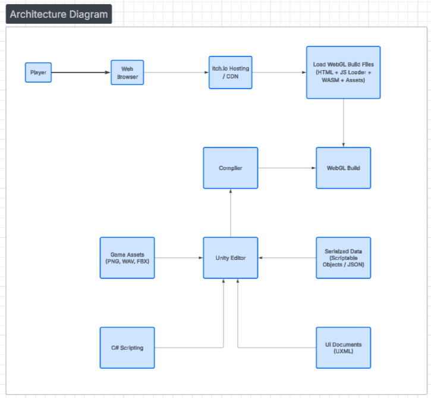
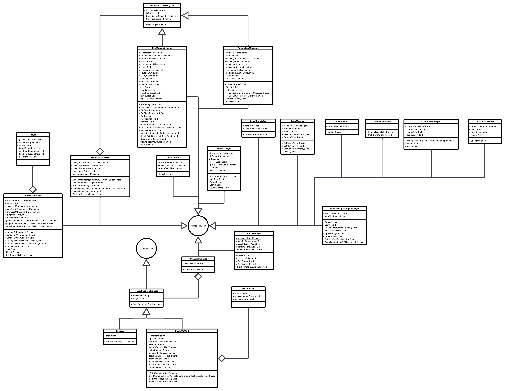
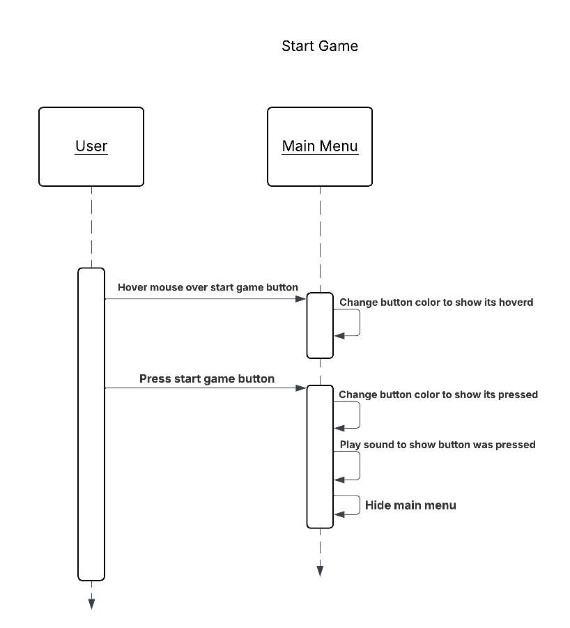
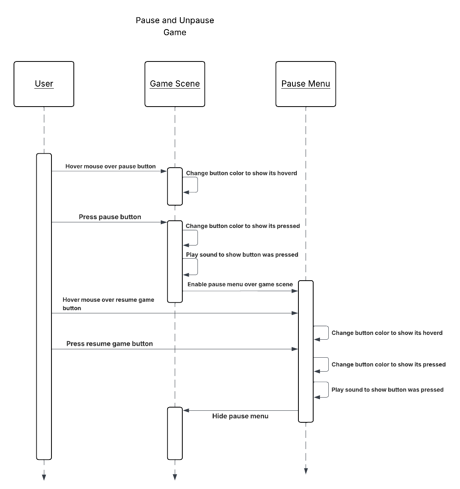
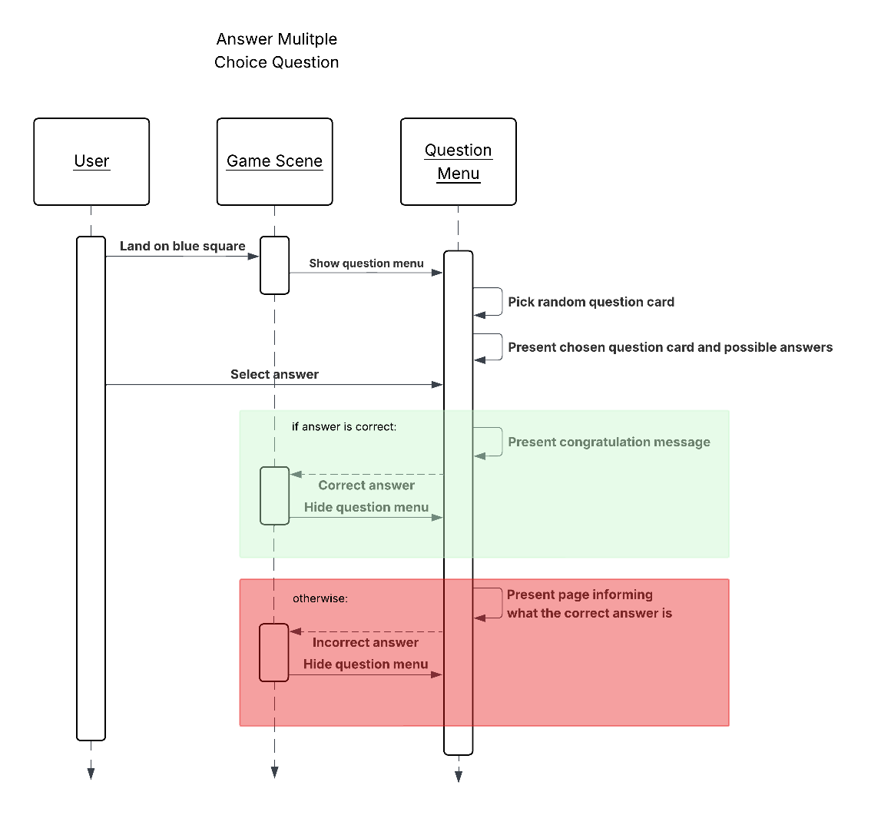
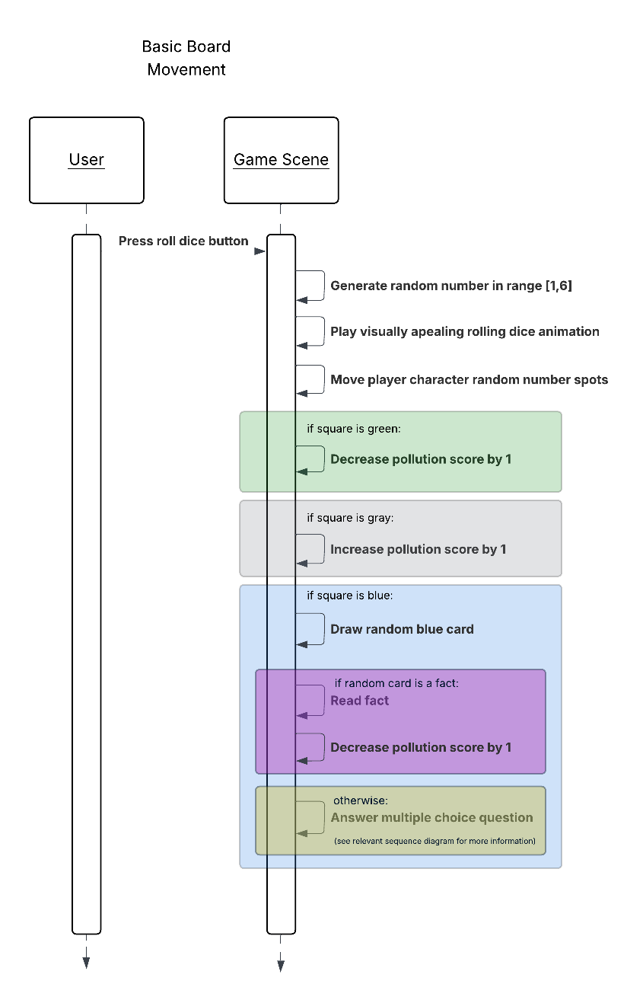

# Software Design

Air Heroes is a browser-based game developed using the Unity game engine and deployed through WebGL for platform-independent access. The system is structured around Unity’s component-based architecture, where core gameplay logic is implemented through modular scripts attached to game objects, enabling clear separation of concerns between input handling, game state management, rendering, and user interface systems. Assets such as models, audio, and scenes are organized into reusable modules to support iterative development and maintainability. The build pipeline targets WebGL to ensure compatibility with modern web browsers as our expected user platform is Chromebooks, and the final build is hosted on Itch.io, providing a lightweight and accessible distribution platform for end users without requiring local installation.

## Architecture Diagram

## UML Class Diagram

## Sequence Diagrams

## Low-Fidelity User Interface

### UI Flow Diagram - Overview

*Tip: Download the image and open it in your system’s image viewer, then zoom in to read the details.*

#### Screen Wireframes

<iframe
  src="../assets/wireframes.pdf"
  width="100%"
  height="900"
  style="border: 1px solid #ccc; border-radius: 8px;">
</iframe>

  <a href="../assets/wireframes.pdf" target="_blank" rel="noopener">
    Open PDF in new tab
  </a>

