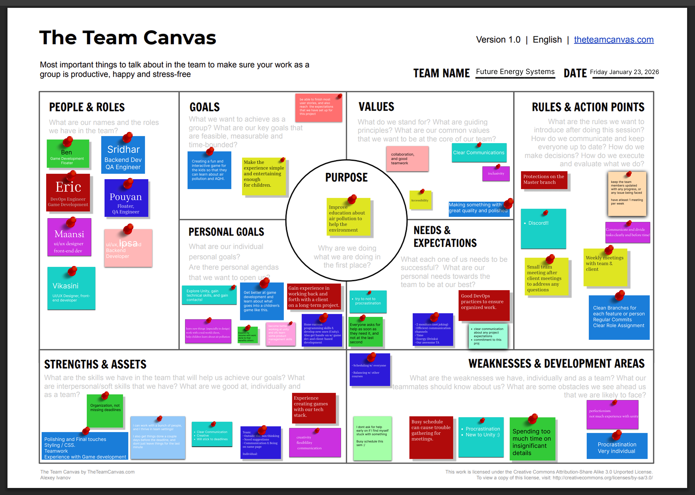

# Teamwork

## Team Canvas

## Belbin Roles

| Name | Preferred | Manageable | Least Preferered |
| -------- | -------- | -------- | -------- |
| Eric Cope | IMP, ME, CF | SH, PL, TW | SP, CO, RI |
| Ben Bingham | CF, SP, IMP | SH, PL, TW | CO, ME, RI |
| Sridhar Saravanakumar | TW, PL, IMP | SP, ME, RI | CF, CO, SH |
| Vikasini Senthilkumar | SP, IMP, PL | ME, CO, CF | SH, TW, RI |
| Pouyan Razmi-Nia | TW, IMP, CF | SP, CO, PL | ME, RI, SH |
| Maansi Sharma | PL, SP, TW | CF, CO, ME | RI, IMP, SH |
| Ipsa Manhas | TW, RI, SP | IMP, CF, ME | CO, PL, SH |

## Scrum Roles

| Sprint    | Scrum Master          | Product Owner         |
| --------- | --------------------- | --------------------- |
| Sprint 1  | Sridhar Saravanakumar | Ben Bingham           |
| Sprint 2  | Sridhar Saravanakumar | Vikasini Senthilkumar |
| Sprint 3  | Eric Cope             | Vikasini Senthilkumar |
| Sprint 4  | Ben Bingham           | Ipsa Manhas           |
| Sprint 5  | Vikasini Senthilkumar | Sridhar Saravanakumar |

### Thinking Roles
#### PL (Plant)
Creative, spends their time solving problems

- Maansi Sharma (Preferred)
- Sridhar Saravanakumar (Preferred)
- Vikasini Senthilkumar (Preferred)

#### ME (Monitor Evaluator)
Strategically considers all options

- Eric Cope (Preferred)
- Sridhar Saravanakumar (Manageable)
- Vikasini Senthilkumar (Manageable)
- Maansi Sharma (Manageable)
- Ipsa Manhas (Manageable)

#### SP (Specialist)
An expert in a small number of areas

- Vikasini Senthilkumar (Preferred)
- Maansi Sharma (Preferred)
- Ben Bingham (Preferred)
- Ipsa Manhas (Preferred)

### Action Roles
#### SH (Shaper)
Problem solver

- Eric Cope (Manageable)
- Ben Bingham (Manageable)

#### IMP (Implementer)
Turns plans into concrete output

- Eric Cope (Preferred)
- Vikasini Senthilkumar (Preferred)
- Pouyan Razmi-Nia (Preferred)
- Sridhar Saravanakumar (Preferred)
- Ben Bingham (Preferred)

#### CF (Completer Finisher)
Polishes and finds errors

- Ben Bingham (Preferred)
- Eric Cope (Preferred)
- Pouyan Razmi-Nia (Preferred)

### People Roles
#### RI (Resource Investigator)
Enthusiastic and communicative

- Ipsa Manhas (Preferred)
- Sridhar Saravanakumar (Manageable)

#### TW (Teamworker)
Listens and helps teams stay cohesive

- Sridhar Saravanakumar (Preferred)
- Pouyan Razmi-Nia (Preferred)
- Ipsa Manhas (Preferred)
- Maansi Sharma (Preferred)

#### CO (Coordinator)
Great delegator

- Vikasini Senthilkumar (Manageable)
- Pouyan Razmi-Nia (Manageable)
- Maansi Sharma (Manageable)
